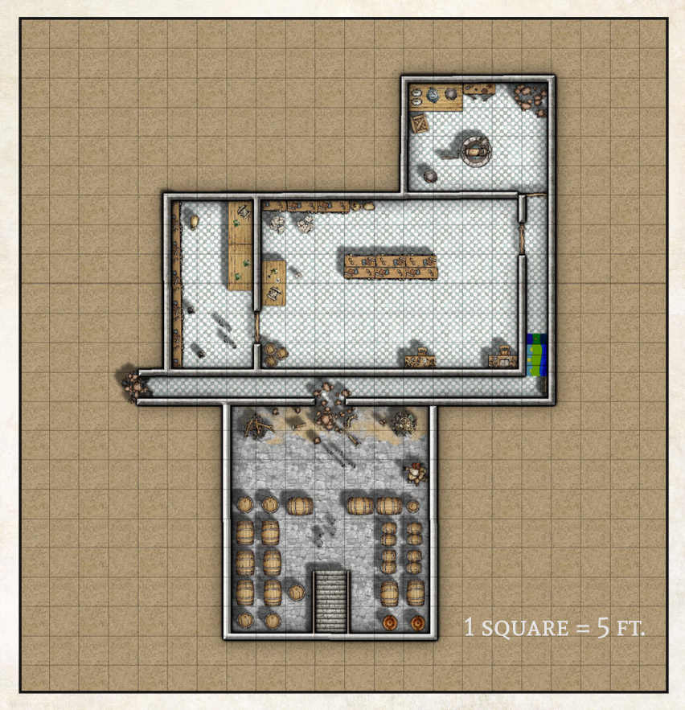

The Wizard’s Tower Brewing Co. - a craft brewery known for its hoppy summer ales - is in dire need of help from a band of reliable, affordable adventurers. The owner has posted a job on the local notice boards and is calling in favors from friendly innkeepers all over town to spread the word. 

The party may hear about the work by examining job boards set up in the square, talking to an old friend or simply chatting to the locals over a pint. 

However this happens, they are instructed to ask for Glowkindle at the Wizards’ Tower Brewery. Most innkeepers and beer aficionados will be able to point hopeful adventurers in the brewery’s direction, so long as they ask politely and maybe buy a drink first! 

If you are running the game for new players, it may be best to start the adventure with them already on the road.

## Meeting Glowkindle
You follow the directions you’ve been given, trudging maybe a mile or two out of town along an old dirt road that winds its way up a low hill.

As you near the top a large stone building comes into view, flanked by a couple of barns. By the door is a brightly painted sign that reads 'The Wizard’s Tower Brewing Co. For the Freshest Pint in the Realm!'

Should the adventurers knock on the door it will be answered by a fairly young Gnome who nevertheless sports an impressive beard, as well as a white shirt and tight black trousers held up with green suspenders. This is Glowkindle, the owner of the brewery.

After a moment of confusion he will notice the party’s weaponry and magical tools and realise they must be adventurers. The gnome offers to explain what he needs from the party over a drink and - if they’re willing - will lead them into a small bar set up in a corner of the brewery.

The entire building is infused with the smell of hops and beer, but is clean and well-organised. A few humans and halflings, dressed much as their boss, wander about, checking on barrels and vats of bubbling liquid with no sense of urgency. 

After handing out pints of Tashalar Pale Ale to anybody who wants it, Glowkindle explains:
- The business has been doing well and was looking to
expand its operations. In order to do this, they first needed
to expand their beer cellar.
- He had some workmen down there, digging out some
extra room, when they uncovered an old wall - the remnant
of some long-forgotten ruin, presumably. Curious, they
knocked a hole in the wall, only to be attacked by “black
rats the size of dogs! Big dogs too, not poodles, you know?”
which emerged from the darkness on the other side.
- They all managed to escape with nothing worse than a
few cuts and bruises, but the cellars are completely
unusable. If they want to get production starting again, he
needs the adventurers to deal with the giant rat infestation.
- He isn’t sure where the rat came from, but the brewery
took its name from the old Wizard’s Tower that used to be
on the site, so it may be something to do with that.

The terms of the job are that the party disposes of the rats,
finds out where they came from and make sure they won’t
suffer any other similar surprises in the future. In return, he
will pay **25gp per party member**.

Should they agree, Glowkindle will lead the adventurers to
the cellar entrance - a hatch in the floor of their main
brewing area - and wish them luck.

## Map
