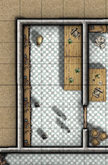

import { Aside } from '@astrojs/starlight/components';

<Aside title="Flavour Text">
*The rear wall of this small room is lined with sturdy-looking wooden shelves. Clearly these were once laden with bottles and glass vials, but over the years many of these have been reduced to glittering shards ofglass on the floor.*

*There's a flicker of movement among the wreckage and you see a small black rat lapping up the last remnants of liquid left the shattered remains ofa dark blue bottle.*
</Aside>

The broken bottle the rat is drinking from has the torn
remains of a white label affixed to it. The writing on it reads:

> "-tion of Enlargement"

After roughly one minute the rat will transform into a Giant Rat unless disposed of. Another smashed and empty bottle on the floor is labelled:

> 'Essence of Fire Ele-'

There are a handful of bottles still left on the shelves, however. There are:

- Two Potions of Healing, 
- Potion of Invisibility,
- Potion of Vitality.

## Potion Variants
- Potion of Haste
- Potion of Enlarge
- Potion of Spider Climb

## Map
