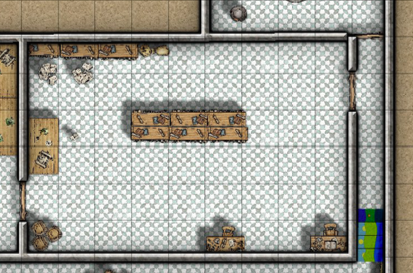

import { Aside, Card } from '@astrojs/starlight/components';
import Monster from '../../../components/Monster.astro'

<Aside title="Flavour Text">
*The door opens onto what might once have been a lab or
workroom. To your left sits a mouldering desk and the
shattered remnants of alchemical glassware, while the centre
of the room is dominated by a set of tall bookcases arranged
back-to-back.*

*All around, however, are scorch marks and signs of countless small fires and the air is filled with the smell of smoke and burned meat.*

*The wooden furniture is blackened and burned in places, while what may once have been a pile of books has been been reduced to ash. Singed traces of what may be webbing hang from the ceiling.*

*As you enter you feel something crunch beneath your feet - glancing down, you realise that it's the charred hindquarters of a Giant Rat.*
</Aside>

<Aside type="tip" title="Wizard's Spellbook: DC13 Wisdom (Perception) check">
However, a character that searches the room and is able to make a DC13 Wisdom (Perception) check will notice that one of the books seems strangely undamaged. 

The book is a Wizard's Spellbook that contains the following spells:
- Detect Magic, 
- Identify and 
- Arcane Lock spells
</Aside>

## Giant Inferno Spider
A Giant Inferno Spider - the product of a couple of spilled potions from the Storeroom - is lurking in the shadows at the **southwest** corner of the room. The beast is around eight feet across but is adept at hiding on the ceiling of its lair, giving it **Advantage on Dexterity (Stealth) checks**.

The creature will scuttle along as stealthily as possible in the hope of ambushing an adventurer with its Burning Web ability, which it will use as often as possible. Years of waste and the flames spread by the Giant Inferno Spider have rendered most of the books and equipment completely unusable. 

<Monster slug="giant-inferno-spider" />

## Map
