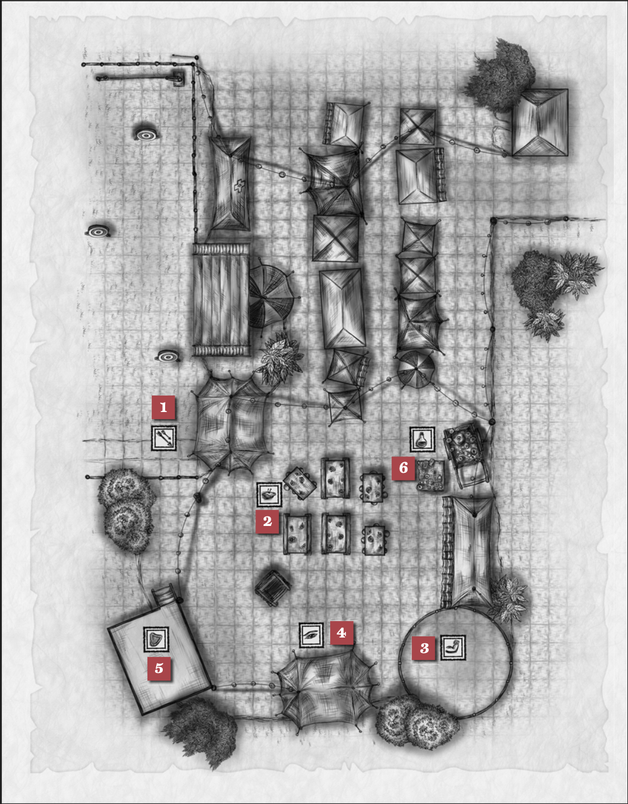

import { Aside } from '@astrojs/starlight/components';

The site of the region’s annual “FeatFest,” this open-air fairground is centrally located within the town proper and serves as a showcase for area athletes, adventurers and anyone looking to enjoy a turkey leg or impressive displays of skill. Townsfolk from miles around come to compete against their peers to determine who among them is the most gifted at a particular task. There are proving grounds for smithies, knife-jugglers, cooks, bards, the arcanely attuned and more.

## Atmosphere
The entire town practically shuts down as its denizens descend on FeatFest en masse. Attendees are a bit more gleeful than you’d typically find in town.

## Events
FeatFest is a celebration of skill. The below events are examples of the types of competitions your party might encounter at FeatFest, with entry fees of 1sp per. Prizes for outright winners are at GM discretion.

### Archer Alley (1). 
Each target has a ring worth different point totals. Arrows hitting within the ring count toward the point total. Competitors have 3 shots each to secure the highest score possible. A competitor must declare their shot on a target, but not the ring they’re aiming for. A competitor can call a specific ring for a +1 bonus, but if they miss they are awarded no points. Competitors can also choose to use other ranged attacks for this challenge at GM discretion.

#### Close Range
Outer: AC 12 (2 Points)
Inner: AC 13 (4 Points)
Bullseye: AC 14 (6 Points)

#### Mid Range
Outer: AC 16 (8 Points)
Inner: AC 17 (10 Points)
Bullseye: AC 18 (12 Points)

#### Long Range
Outer: AC 20 (14 Points)
Inner: AC 22 (16 Points)
Bullseye: AC 24 (18 Points)
**Bonus Bell**: AC 26 (D) (25 points)

<Aside type="tip" title="GM Note">
The tiny Bonus Bell is attached to a gear and pulley system so it rotates and moves around the back of the alleyway. Because of its size and rapid movement, shots fired at the Bonus Bell are made with disadvantage.
</Aside>

### Meat Pie Eating Contest (2).
Each competitor must consume five meat pies, with the first to eat all five without losing their meal declared the winner. To run the contest, have each player roll 1d20 at a time, adding their Constitution modifier. Consuming one pie requires a cumulative roll of 30. Once a player has accumulated **30 points**, they must make a **DC 10 Constitution saving throw**, spitting up the pie on a failed save. If they succeed on the save, they can begin eating their next pie. Continue this process, **raising the DC on the Constitution save by +1** for each subsequent pie. If a competitor finishes the final pie, they must succeed on a **DC 16 Constitution saving throw** to call themselves the pie eating champion.

### Grappling Pit (3). 
Two opponents face off in the center of this ring to see who can toss the other out first. In the spirit of FeatFest, **no magic is allowed**. To win, a competitor must **succeed on three contested Strength rolls in a row**: One to grapple, one to lift and one to toss.

### Liars and Truthseekers (4). 
Alowen Tanash, a wizened half-elf with a cunning glint in his eye, runs this one-on-one competition, where those with a talent for reading people (and those who think they have a knack for deception) can showcase their skills. 
1. Choose a liar and/or a truthseeker. 
2. The liar makes three statements, one of them a falsehood. 
3. The truthseeker can roll a **Wisdom (Insight) check** against the **liar's Charisma (Deception)** to determine which of their statements is false. 
Alowen can act as either the liar or the truthseeker in the event that only one challenger approaches, with a **DC of 20 for both his Insight and Charisma checks**. Anyone who fools Alowen or sniffs out his falsehoods three times in a row is granted his blessing: **+3 to your next Insight or Deception check**.

### Dances of Lore (5). 
The Dances of Lore are a highlight of FeatFest, a chance for sages and minstrels to work together to keep a meaningful memory alive. Archivists and historians pair off with performers of all stripes to present a short interpretive song, dance or other storytelling medium that details a meaningful moment from the past. The most moving story is named the year's Tale of the Festival and will be performed throughout the realm until the following year's FeatFest. 

Players can serve as historians or performers and pair up or partner with an NPC to create a **combined Intelligence (History) and Charisma (Performance) score**, describing the story they want to have interpreted onstage. The highest score of the day (**top NPC score is 31** with “The Terrible Tale of Red the Blue”) wins the honor of Tale of the Festival.

### The Amazing Presto's Wagon (6).
A potionmaker named Preston Glimbow is hawking his wares from a flashy-looking wagon.

## Map
