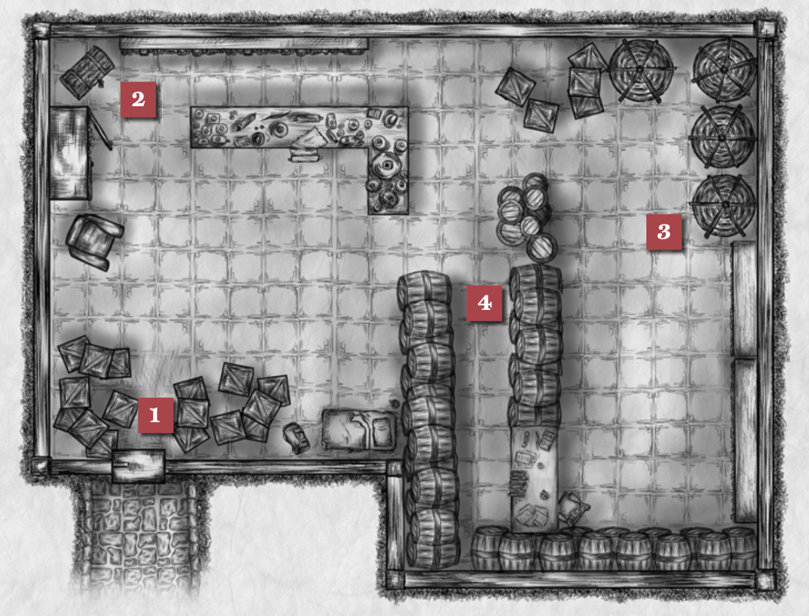

import { Aside } from '@astrojs/starlight/components';
import Monster from '../../../components/Monster.astro'

This subterranean space is the staging ground for potion-making apprentice (and lover of fine hats) Hold Hammerhearth's rise to power.
Accessible through the city's system of underground tunnels, this long-abandoned storage space was claimed by Hold Hammerhearth and serves as his base of operations. The space features a large workstation for the creation of custom hats and a secondary space, separated from the first by a large wall of barrels, where potions are conceived, batched and bottled. Amid the meticulously staged mess is a bed fit for a dwarf, a modest wardrobe and scattered boxes of fabrics, felt and dyeing agents.

## Map

### 1. Entryway
There are crates blocking the path into the room (1), making the first 15 ft. into the space difficult terrain for anyone trying to walk through.

### 2. Hat Station
This large workstation (2) is covered in sketches for soon-to-be crafted hats of all shapes and sizes, as well as bits of felt, sheers, a rounding jack, flange stand, brim trimmer and other tools of the hatter's trade. Hanging from artfully spaced hooks on the wall beyond the workstation are rows of immaculate hats of all sizes, colors and designs.

### 3. Potion Lab
A space for conceiving, mixing and batching custom potions (3). The large, unlabeled vats in the corner contain the following, in any designation you choose. If a vat breaks against a creature or they are tossed inside, they will be immediately influenced by the liquid inside due to the sheer volume covering their body.

<Aside type="caution" title="Large Potion Vats">
| 1d4       |         |
| -------- | ------- |
| 1 | **Potion of Levitation.** A creature who consumes this potion will fall under the effect of the levitation spell. |
| 2 | **Potion of Enlarging.** A creature who consumes this potion will fall under the effect of the enlarge spell. |
| 3 | Potion of Slow. A creature who consumes this potion will fall under the effect of the slow spell. |
| 4 | Potion of Lycanthropy. Roll 1d4. A creature who consumes this potion will turn into a werewolf (1), werebear (2), wererat (3) or weretiger (4) for 1d6 hours. |
</Aside>
<Monster slug="werebear-human" />
<Monster slug="wererat-human" />
<Monster slug="weretiger-human" />

### 4. Barrel Wall
These barrels (4) are all full of potions created by Hold Hammerhearth, either to further his own business or subvert his employer's. The barrels are unlabeled, though it's more than likely Hold has a sense of what's what. If a barrel bursts or its contents are investigated by someone proficient in potion-making (DC 15 Alchemist's or Herbalist's kit), roll on the table below to determine its contents. If a barrel breaks against a creature, they will be immediately influenced by the liquid inside due to the sheer volume covering their body. All saves related to the potions are set at DC 15.
<Aside type="caution" title="This barrel contains...">
| 1d4       |         |
| -------- | ------- |
| 1 | **...a powerful solvent** (2d6 acid) used in hat-making, which causes 2d6 acid damage. |
| 2 | **...a powerful glue used in hat-making.** If hit with glue, a creature is considered grappled and must succeed on a DC 17 Strength (Athletics) check in order to escape. |
| 3 | **...potion of levitation.** A creature who comes into contact with this potion is under the effect of the [*levitation*](](https://www.dndbeyond.com/spells/2165-levitate)) spell. |
| 4 | **...potion of confusion.** A creature who consumes this potion is under the effect of the [*confusion*](https://www.dndbeyond.com/spells/2038-confusion) spell. |
| 5 | **...[potion of minor healing](https://roll20.net/compendium/dnd5e/Potion%20of%20Healing).** A creature who comes into contact with this potion will heal 1d4 + 5 HP. |
| 6 | **...potion of fear.** A creature who comes into contact with this potion is under the effect of *[fear](https://www.dndbeyond.com/spells/2094-fear)* spell, and is frightened of the creature that forced the contact. |
| 7 | **...magical grease.** A creature who comes into contact with this potion is under the effect of the *[grease](https://www.dndbeyond.com/spells/2127-grease)* spell. |
| 8 | **...potion of blindness.** A creature who comes into contact with this potion is under the effect of the *[blindness](https://www.dndbeyond.com/spells/2018-blindness-deafness)* spell. |
| 9 | **...potion of haste.** A creature who comes into contact with this potion is under the effect of the *[haste](https://www.dndbeyond.com/spells/2138-haste)* spell. |
| 10 | **...potion of enfeeblement.** A creature who comes into contact with this potion is under the effect of the *[enfeeblement](https://www.dndbeyond.com/spells/2225-ray-of-enfeeblement)* spell. |
</Aside>

