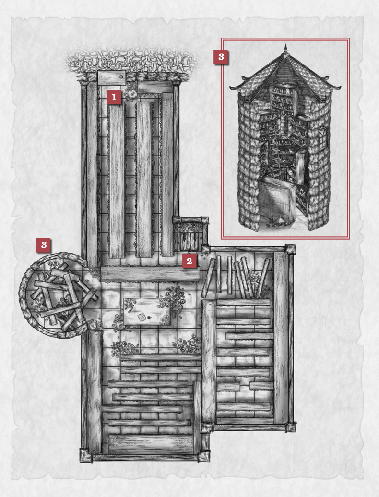

import { Aside } from '@astrojs/starlight/components';

Derisively nicknamed “Perilous Potions” by the locals, this overstocked shop is practically overflowing with vials and beakers and flasks of all sizes. The proprietor, a rather gaunt halfling mage named Damian Cleese, rarely leaves the shop, as much a shrine to his own alchemical artistry as a place for adventurers to stock up on all manner of potions—assuming they can be found among the myriad bottles that line every wall, shelf and free tile on the floor. A clear message greets any who would enter the shop: 

> "All sales final. You break it, you buy it. Potions may be poison—steal at your own risk.""

## Entryway
The foyer of the shop **(1)** is a harbinger of things to come. Tall shelves precariously packed with potions are placed quite close together, forming narrow aisles with clinking glass bottles through which patrons must pass if they're inclined to shop here. Any creature wishing to walk down an aisle must do so with care, as any errant movement is likely to knock over a potion or three (see “Mind the Bottles” table).

## Basement
<Aside type="tip" title="DC 20 Sleight of hand (Dexterity) check">
This trapdoor **(2)** is locked and requires a DC 20 to pick.
</Aside>
It leads to a tunnel connected to the city's cavernous sewer system, and evidence suggests it might be used by Damian to sell goods to customers who don't want to be seen entering the shop. 
<Aside type="tip" title="DC 20 Intelligence (Investigation) check">
Player learns what the tunnel is used for.
</Aside>

## Goods
Damian's renown for potion-making is well-earned, but his lack of a meaningful organizational system is equally legendary. Pretty much any potion imaginable can be purchased at his shop, provided you possess the coin and the ability to find it. 

An Intelligence (Investigation) check based on the potion's rarity is required for a shopper to locate the potion they seek (see “Did You Find It?” table).

<Aside type="tip" title="DC 20 Charisma (Persuasion) check">
For his part, Damian is generally too consumed with his work to bother in assisting the search, though he can be utilized to procure specific goods via a DC 20 Charisma (Persuasion) check (or at GM discretion).
</Aside>

Pricing is also at GM discretion, and market price is fair, however, Damian can be convinced to reduce prices through meaningful haggling if adventurers are so inclined.

## Shelf Tower
Along one side of the shop, the shelves stretch higher **(3)**, haphazardly stacked atop one another, filling the silo-like space and reaching heights of almost 80 ft.—rising up through the entirety of what was once a former guard tower. 

<Aside type="tip" title="5 consecutive Dexterity checks (DC 15)">
Reaching potions located on the uppermost shelves in this area requires success on 5 consecutive Dexterity checks (DC 15). A fail constitutes a fall, which also forces a roll on the “Mind the Bottles” table as the shelves shake and sway with the sudden weight change. Additionally, should an adventurer attempt to climb the shelves after a fall, the DC increases by 1 for each fall (up to a max of 20) as the shelves become less stable with each attempt.
</Aside>

## Variant Encounters

<Aside type="note" title="Encounter Variant (Optional) - Mind the Bottles">
Each time an adventurer passes down an aisle, either to enter, exit or otherwise explore the shop, they must make a Dexterity (Acrobatics) check to avoid knocking bottles off the shelves or to avoid knocking over full cases of goods. Due to their less cumbersome frames, small creatures may roll with advantage.

| DC       |         |
| -------- | ------- |
| 1-5 | 1d4 bottles fall off the shelf and break. |
| 6-14 | One bottle slips, but the player in question can make a Dexterity save (DC 15) to prevent it from breaking. |
| 15+ | No bottles fall. |
</Aside>

<Aside type="note" title="Encounter Variant (Optional) - Did You Find It?">
An adventurer may seek a specific potion by making an Intelligence (Investigation) check in a specific aisle of the shop and meeting the DCs outlined below. Each subsequent search of an aisle requires a Dexterity save as outlined in the “Mind the Bottles” table.

| DC       |         |
| -------- | ------- |
| 10 | Common Potion |
| 15 | Uncommon Potion |
| 20 | Rare Potion |
| 25 | Very Rare Potion |
| 30 | Legendary Potion |
</Aside>

## NPC Profile
### Damian Cleese, halfling mage
The shop's owner and sole manager, Damian obsessed with the meticulous magic art required to brew alchemical wonders. His slim build and shabby exterior suggest a man who would rather work than eat, sleep or bathe. In fact, it's rumoured he doesn't need to do much of all three, his potions keeping him alert, sated and, when necessary, smelling of fresh dew and summer pine. He get surly when kept from his work for too long and will just as soon usher individuals out of his shop than wait for them to buy something.

## Map
