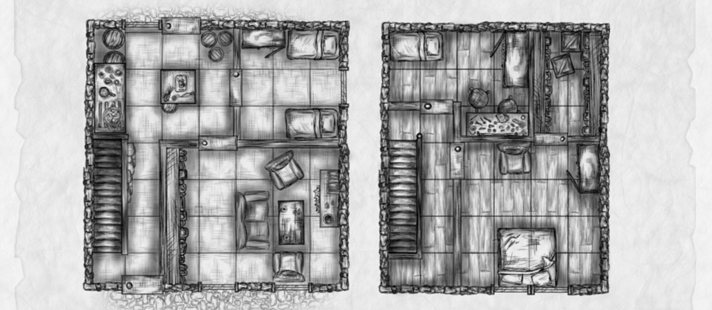

import { Aside } from '@astrojs/starlight/components';

Who lives in this home? A few dice rolls hold the answer.

## Residents
If you're unsure of who lives in this home (meaning you aren't using it as the residence of an established NPC), roll on the Random NPC Generator (pg. 237) to create a homeowner. Then roll on the tables below to determine the status of the house itself.

## Interior
A kitchen, a large living space and three bedrooms represent the bulk of the interior space of this domicile. A back door leads to an alleyway/open landscape behind the house.

## Map

### Appearance
<Aside type="note" title="Roll 1d4 to determine the overall appearance of the house.">
| 1d4      |         |
| -------- | ------- |
| 1 | **Quaint.** This home is tidy if a bit cramped, and feels as though it's been lived in for years if not generations. |
| 2 | **Minimalist.** This home is free of the trappings most accrue over a lifetime and is instead adorned only with necessary elements—a modest wardrobe, a table, a few chairs, some beds and little else. |
| 3 | **Cluttered.** A hoarder dwells here and each room is stuffed with the items they've collected over the course of their entire life. Each room is difficult terrain, as creatures must negotiate the piles of accrued items to get anywhere. |
| 4 | **Abandoned.** This home is empty, and the location of its owner is unknown (except to the GM). |
</Aside>

### Variant Encounter
<Aside type="caution" title="Roll 1d6 to reveal what dangers dwell within this otherwise pedestrian abode.">
| 1d6      |   The party encounters...      |
| -------- | ------- |
| 1 | ...2d4 **goblins** doing their best to impersonate the halfling family they buried in the yard. |
| 2 | ...a cow on the second floor that can't seem to make its way down the stairs. |
| 3 | ...a man and wife who live in fear of their child, a young telepath with psionic abilities. |
| 4 | ..a pair of **ghosts** who keep pestering the family within to go solve their murders. |
| 5 | ...an **arcanaloth** in the guise of a friendly old woman who loves to garden, but also really, really wants some spell scrolls. |
| 6 | ...a family of **dopplegangers**, doing their best to ingratiate themselves to the local nobility. |
</Aside>